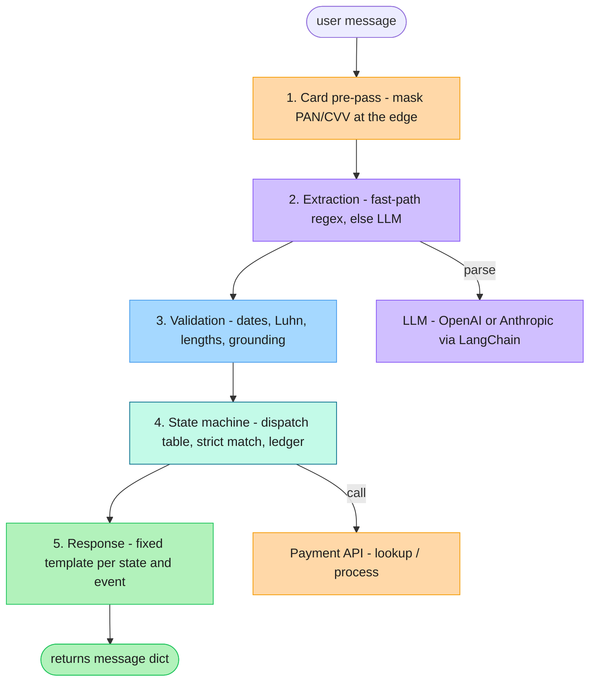

# Design Document: Payment Collection Agent

## Architecture

The agent is a deterministic state machine with an LLM attached as a parser. Every call to `Agent.next()` runs the same pipeline:

Each step maps to a module: `agent.py` (pre-pass + orchestration), `extraction.py` (fast-path + LLM), `validators.py` (validation + grounding), `state_machine.py` (transitions + ledger), `templates.py` (replies).

The LLM has one job: step 2, turning "yeah my account number is ACC 1001 I think" into `{intent: provide_info, account_id: "ACC1001"}`. It never sees account data from the lookup API, never decides whether verification passed, and never writes the reply. The hard rules (no payment before verification, strict matching, no exposure of account data) all live in code, where they cannot be talked around.

State is one dataclass held by the `Agent` instance: current state, the looked-up account record (a validated typed model, not a raw dict), the user's identity claims, retry counters, a payment ledger, and (briefly) card details. Each turn is dispatched to a small per-state handler, and one message may advance several states in the same turn (an amount and a card arriving together) without re-asking.

## Key decisions

**LLM for extraction, code for everything else.** Regex alone cannot read "I want to pay a thousand rupees" or pick the name out of "you can call me Raja but my full name is Rajarajeswari Balasubramaniam", and the evaluator is an LLM playing varied users, so input variety is open-ended. A pure-LLM agent fails the other way: models fuzzy-match names by default, and a prompt rule like "do not skip verification" can be argued around. Splitting the roles keeps the flexible part flexible and the strict part strict. The extractor runs on either OpenAI or Anthropic through LangChain's structured-output interface (chosen by `EXTRACTOR_PROVIDER`, default OpenAI / `gpt-5-mini`, Anthropic / `claude-haiku-4-5`); nothing downstream depends on which.

**Account data never enters the LLM context.** The lookup API hands the client the DOB, Aadhaar last 4, and pincode. Verification compares the user's claims against them in plain Python. If those values were in the prompt, a user could try to pull them out ("what DOB do you have on file?"). Kept out of the prompt, there is nothing to leak.

**Where extraction ends and exact matching begins.** The rules forbid fuzzy matching, but real input is spoken-style, so a line was drawn. Extraction strips only what is clearly not identity: surrounding words ("it's", "my name is"), repeated spacing, and date formatting. Name matching is then case-sensitive exact equality, because the assignment forbids case-insensitive name matching. "it's Nithin, Nithin Jain" becomes "Nithin Jain" and matches; "Nitin Jain" (misspelled) fails, and so does "nithin jain" (wrong case). No edit distance, no phonetics, no case folding. The cost is that a user who types their name in the wrong case is asked again, which the strict reading of the rule accepts.

**A client-side payment ledger.** The server never persists balance updates, which quietly puts balance correctness on the agent. Re-fetching after a payment returns the original balance, so "now clear the rest" would overcharge and a repeated "pay the full amount" would double-charge. The agent records each successful payment and computes the remaining balance itself. This state lives and dies with the conversation, which matches a server that forgets too.

**Idempotent payments, and terminal vs retryable failures.** Each charge carries an idempotency key, generated once and reused across any retry, so a payment that times out can be retried on the user's "confirm" without risking a double charge. The key is cleared once the charge settles or its parameters change, so a genuine second payment is never read as a duplicate. Declines are then split by who can fix them: a bad card, CVV, or expiry is user-fixable and re-collects the card; an over-balance or malformed amount re-asks the amount; an unrecognized code is treated as terminal and the session closes cleanly instead of looping.

**Card data is masked at the edge.** A regex pre-pass captures card-number and CVV digits before the message is stored. History keeps "card ending 0366", and the real values sit in one short-lived field that is wiped after the payment call. One residual: a card number spelled out in words passes through a single extraction call before masking. The real fix is to take card capture out of the chat channel, which this interface does not allow, so the limit is named rather than hidden.

**Grounding check on extracted values.** Models sometimes return a value that was never said. Every identity and card digit field (account ID, Aadhaar 4, pincode, card) must appear in the message after digit normalization, and names must appear as a case-insensitive substring. Anything that fails is treated as not provided. Amount is the exception: shorthand like "1k" or "a thousand" has no digits to match, and the confirmation step shows the amount before any charge, so that is the safeguard instead.

**The LLM extracts, it does not infer.** The extractor pulls only what is literally present and never computes or guesses, and it never sees the balance. One consequence: "pay half" or "a quarter of it" goes nowhere, because "half" carries no number and resolving it would need both the balance and arithmetic the LLM is denied. This is a real limit, and a cheap one to lift later: classify the fraction in the LLM (`fraction: 0.5`) and let code multiply it by the remaining balance, the same way `pay_full` already resolves to `remaining`. It is left out because "pay half" is uncommon and adding it now would be guesswork. The seam is clean.

**Determinism, stated honestly.** Byte-identical output across runs is not possible with an LLM in the loop. What the design guarantees is policy determinism: the same extracted facts always produce the same transitions and API calls. A regex fast-path also skips the LLM for clean inputs like `ACC1001` or `1990-05-14`, which makes the assignment's sample dialogue fully reproducible.

## Assumptions

| # | Ambiguity | Resolution |
|---|---|---|
| 1 | Name case and spacing | Spacing is normalized; case is significant, since the spec forbids case-insensitive name matching, so a wrong-case name is a mismatch |
| 2 | Ambiguous numeric dates ("03-04-1990") | Read as DD-MM (Indian locale); unambiguous forms taken as written |
| 3 | Two-digit years | DOB pivots to the past ("May 14, 90" is 1990); card expiry to the future ("12/27" is 2027) |
| 4 | Verification retry limit | 3 failed attempts, then a terminal locked state; later input gets a polite refusal, never a crash |
| 5 | Mixed factors in one message | Name plus at least one matching factor verifies, as the spec states; a wrong factor alongside a correct one does not block verification |
| 6 | ACC1003 has a zero balance | Tell the user nothing is outstanding and close; card collection is skipped |
| 7 | Amount collection | Not in the 8 listed steps; inserted between sharing the balance and collecting the card |
| 8 | Confirmation before charging | Added ("pay 500 with card ending 0366, confirm?"); the spec neither requires nor forbids it |
| 9 | Rejection wording | Failures never say which factor mismatched, so verification cannot be used as an oracle |
| 10 | `next()` after close | Always returns a valid message; the conversation can end but cannot crash |
| 11 | Payment retry limits | 3 rejected cards or 3 consecutive API outages close the session. Timeouts are exempt: the outcome is unknown, so retrying stays the user's call |

The three retry limits in rows 4 and 11 are read from the environment (`MAX_VERIFY_ATTEMPTS`, `MAX_CARD_ATTEMPTS`, `MAX_API_FAILURES`), each defaulting to 3.

## Tradeoffs accepted

One LLM call per turn adds latency and cost, which the fast-path trims on clean input. Extraction quality caps accuracy, and the grounding check keeps a bad extraction at "asked again" rather than "acted on a wrong value". Balance state is per-session: a new `Agent` knows nothing of prior payments, and neither does the server, so there is nothing to reconcile against. Transaction IDs are the only lasting record that a payment happened.

## With more time

Verification belongs on the server, behind an API that answers yes or no instead of handing the client the answers. A persisted transaction store would let a fresh session reconcile past payments and survive a crash mid-conversation. The persona evaluator could grow further: multilingual input, sustained injection attempts, and users who change their mind mid-payment.
