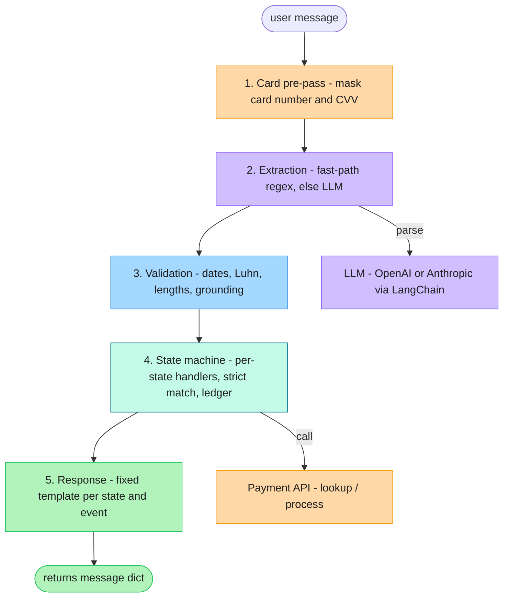

# Design Document: Payment Collection Agent

## Architecture

The agent is a rule-driven state machine; the LLM is used only to read the user's messages. Every `Agent.next()` call runs the same pipeline:

Each step maps to a module: `agent.py` (pre-pass + orchestration), `extraction.py` (fast-path + LLM), `validators.py` (validation + grounding), `state_machine.py` (transitions + ledger), `templates.py` (replies).

The LLM has one job: step 2, turning "yeah my account number is ACC 1001 I think" into `{intent: provide_info, account_id: "ACC1001"}`. It never sees account data from the lookup API, never decides whether verification passed, and never writes the reply. The hard rules (no payment before verification, strict matching, no exposure of account data) all live in code, where they cannot be talked around.

State is one dataclass held by the `Agent` instance: current state, the looked-up account record (a validated typed model, not a raw dict), the user's identity claims, retry counters, a payment ledger, and (briefly) card details. Each turn is dispatched to a small per-state handler, and one message may advance several states in the same turn (an amount and a card arriving together) without re-asking.

## Key Decisions

- **LLM for extraction, code for everything else.**
  Regex can't parse "I want to pay a thousand rupees," but a pure-LLM agent fuzzy-matches names and can be talked out of its own rules. So the flexible parsing stays in the LLM and the strict checks stay in code.

- **Two layers of parsing: a regex fast-path, then the LLM.**
  Step 2 tries fixed regex patterns first and only calls the LLM when they miss. Obvious inputs (a bare `ACC1001`, a date, spaced or spoken digits, a plain yes/no) never reach the model; only messy phrasing does. This keeps the assignment's examples reproducible, lets clean conversations run with no API key, and saves a call on the easy turns.

- **Account data never enters the LLM context.**
  The DOB, Aadhaar last 4, and pincode are compared against the user's claims in plain Python. If they were in the prompt, a user could just ask the model to read them back.

- **Where extraction stops and exact matching starts.**
  Extraction strips only the obvious non-identity words ("it's", "my name is", extra spaces); names are then matched with exact, case-sensitive equality. So "it's Nithin, Nithin Jain" matches, but a misspelling or wrong case is asked again, which the strict reading of the rules allows.

- **An in-session payment ledger.**
  The server never saves balance updates, so re-fetching after a payment returns the original amount and "pay the rest" would overcharge. The agent tracks each payment and works out the remaining balance itself.

- **Idempotent payments, and terminal vs. retryable failures.**
  Each charge reuses one idempotency key (an ID the server uses to ignore duplicate charges) across retries, so a timed-out payment can be retried safely and a genuine second payment isn't mistaken for a duplicate. Declines are split by who can fix them: bad card details re-collect the card, a bad amount re-asks the amount, and an unknown code closes the session instead of looping.

- **Card data is masked on input.**
  A regex catches card and CVV digits before the message is stored, so history keeps only "card ending 0366" while the real values sit in a short-lived field that is wiped after the call. One gap is named openly rather than hidden: a card number spelled out in words slips through a single extraction call first, and the real fix (taking card capture out of chat) isn't possible here.

- **Grounding: extracted values must appear in the message.**
  Every digit field and name must actually show up in the user's text, or it is treated as not provided, since models sometimes invent values. Amount is the exception, because "1k" has no digits to match and the confirmation step catches a wrong amount instead.

- **The LLM extracts, it does not infer.**
  It pulls only what is literally said and never does math, so "pay half" goes nowhere: resolving it would need the balance and arithmetic the LLM isn't given. It could be added later (let the LLM name the fraction, let code multiply), but it is left out as uncommon and guesswork today.

- **Determinism, stated honestly.**
  Byte-for-byte identical output isn't possible with an LLM in the loop, but the same extracted facts always produce the same transitions and API calls. The regex fast-path also skips the LLM entirely for clean inputs like `ACC1001`, so the sample dialogue stays fully reproducible.

## Assumptions

Listed here are only the genuine ambiguities: places where the spec is silent or explicitly leaves the choice to us. Behavior that just follows a stated rule (strict case-sensitive names) or the interface contract (`next()` never crashes) is not an assumption and is omitted.

| #   | Ambiguity                              | Resolution                                                                                                                                                         |
| --- | -------------------------------------- | ------------------------------------------------------------------------------------------------------------------------------------------------------------------ |
| 1   | No data persistence.                   | As per the doc, an evaluator will run on the code. Thus I've chosen to not persist transactions and keep each session independent                                  |
| 2   | Ambiguous numeric dates ("03-04-1990") | Read as DD-MM (Indian locale); unambiguous forms taken as written                                                                                                  |
| 3   | Two-digit years                        | DOB pivots to the past ("May 14, 90" is 1990); card expiry to the future ("12/27" is 2027)                                                                         |
| 4   | Verification retry limit               | The spec says to pick one: 3 failed attempts, then a terminal locked state; later input gets a polite refusal, never a crash                                       |
| 5   | Mixed factors in one message           | Name plus at least one matching factor verifies, as the spec states; a wrong factor alongside a correct one does not block verification                            |
| 6   | Amount collection                      | Not in the 8 listed steps; inserted between sharing the balance and collecting the card                                                                            |
| 7   | Confirmation before charging           | Added ("pay 500 with card ending 0366, confirm?"); the spec neither requires nor forbids it                                                                        |
| 8   | Payment retry limits                   | The spec says split retryable from terminal: 3 rejected cards or 3 consecutive API outages close the session, but timeouts are exempt since the outcome is unknown |

The three retry limits in rows 4 and 8 are read from the environment (`MAX_VERIFY_ATTEMPTS`, `MAX_CARD_ATTEMPTS`, `MAX_API_FAILURES`), each defaulting to 3.

## Tradeoffs accepted

One LLM call per turn adds latency and cost, which the fast-path trims on clean input. Extraction quality caps accuracy, and the grounding check keeps a bad extraction at "asked again" rather than "acted on a wrong value". Balance state is per-session: a new `Agent` knows nothing of prior payments, and neither does the server, so there is nothing to reconcile against. Transaction IDs are the only lasting record that a payment happened.

## With more time

- Replace the rigid state machine with a guardrailed, fine-tuned in-house model, so customer data never leaves our own infrastructure.
- Improve code quality.
- Test on more real edge cases.
